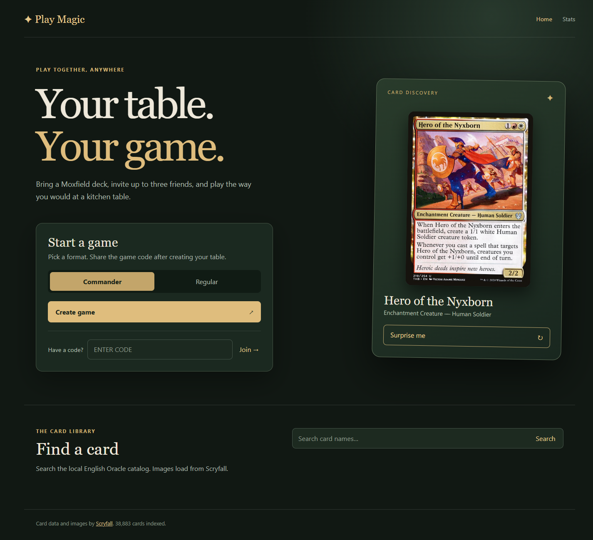
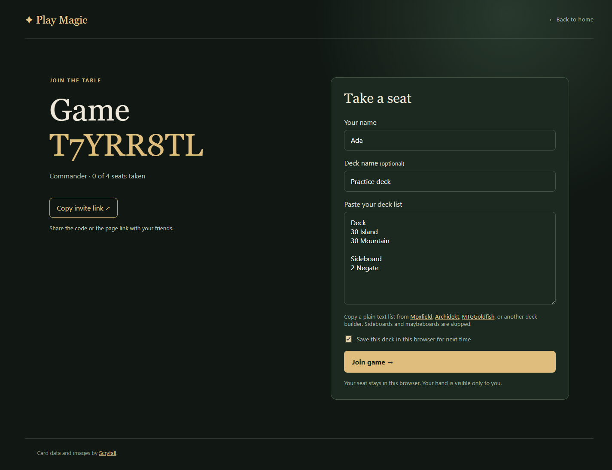
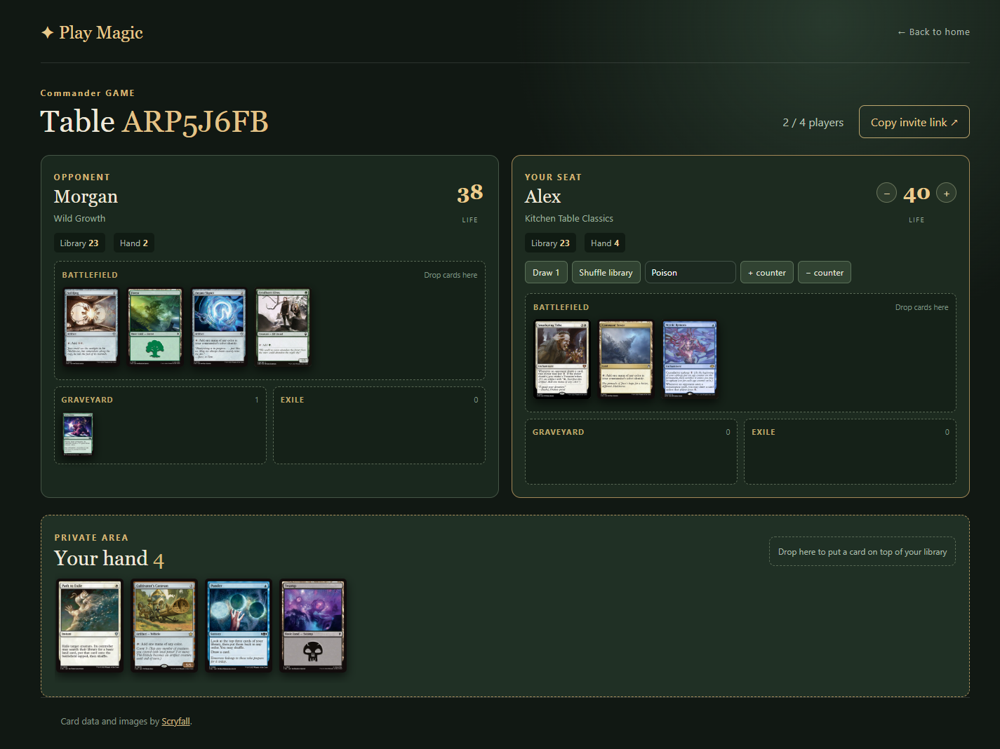

# Play Magic

Play Magic is a shared tabletop for playing Magic with friends online. Paste a deck list, open a Commander or Regular game, and invite up to three other players with a game code or link. There are no accounts to create and no rules engine to get between you and the game.

## Around the table

- Paste a plain text deck list from a deck builder and optionally save it in your browser for another game.
- Start with a shuffled deck and seven cards in your private hand. Other players see your hand count, not your cards.
- Move cards among your hand, battlefield, graveyard, exile, and library. Tap cards, add counters, draw, shuffle, and track life and player counters.
- Explore the card library between games. Card data and images come from Scryfall.

### Home



### Joining a game



### Game



## How to play

1. Choose **Commander** or **Regular** and create a game.
2. Share the eight-character code or game link with your friends. A table holds up to four players.
3. Enter your name and paste a plain text deck list. You can copy one from [Moxfield](https://www.moxfield.com), [Archidekt](https://archidekt.com), or [MTGGoldfish](https://www.mtggoldfish.com). Use lines like `1 Sol Ring` or `1x Sol Ring`, with optional `(SET) 123` printing details. If you want to reuse the list, check **Save this deck in this browser for next time** before joining.
4. Play as you would at a kitchen table. Click a card to see its details and available actions, or drag it between zones.

Play Magic leaves rules, turn order, commander zones, and card abilities to the players. Your seat and saved deck lists are kept in the browser where you joined; clearing that browser's storage removes them. Saved decks are a convenience, limited to ten per browser, and can be removed from the join form. The community stats page in the app shows active tables alongside cumulative game, player, deck, and card discovery totals.

## Contributors

### Run locally

Play Magic uses ASP.NET Core 10, Blazor interactive server components, EF Core, and SQLite. From the repository root, run:

```powershell
dotnet run --project src/PlayMagic/PlayMagic.csproj --launch-profile https
```

Open the URL printed by `dotnet run`. On first startup, the app downloads Scryfall's English Oracle Cards bulk file and indexes it in `src/PlayMagic/Data/playmagic.db`. The home page can show a live random card while that first import runs. A background worker checks for a new bulk file every 12 hours and refreshes the local catalog once it is a week old. Card images remain on Scryfall's image host.

The default SQLite path is under the app's `Data` directory. Set `ConnectionStrings__PlayMagic` to use another SQLite connection string. Schema migrations run at startup. Game state survives server restarts; live updates currently assume one app server instance.

### Verify changes

```powershell
dotnet test PlayMagic.slnx
```

The tests cover four-seat limits, private hands, card ownership, text import sections, and public statistics.

Open the repository root in VS Code and select **PlayMagic (HTTPS)** in Run and Debug. F5 restores and builds the solution, starts the app, and opens its URL. **Terminal → Run Task** offers `restore`, `build`, `build: Release`, `test`, and `run`. The C# extension is recommended by the workspace. GitHub Actions restores, builds in Release mode, and runs the tests on pushes and pull requests.

For production hosting on a DigitalOcean Droplet behind Cloudflare, see the [deployment guide](deploy/README.md). The manual **Publish to production** workflow builds, tests, and deploys the app after the one-time server and GitHub environment setup.

### Operations and data

The public `/stats` page counts active tables, game rooms created, games played, player joins, cards loaded into decks, and random cards drawn, with a format breakdown. Active tables are rooms that have not reached their cleanup deadline. A game counts as played when its second player joins. The cumulative totals remain after game cleanup. On upgrade, the migration initializes counters from games still in the database; previously pruned games cannot be recovered.

An hourly cleanup removes unjoined games after 24 hours and joined games after 30 days without activity, including their seats and cards. Viewing a game with a valid seat token counts as activity. Existing games get a fresh grace period when the activity tracking migration runs.

Game creation is limited to five attempts per IP address per 10 minutes; joining is limited to ten. Excess attempts receive HTTP 429 with a retry time. These in-memory limits reset on server restart and apply per app instance. Behind a reverse proxy, configure trusted forwarded headers so the app sees each visitor's IP address.

The paste parser accepts common plain text and Arena style `Deck` / `Commander` sections, including quantity prefixes such as `1`, `1x`, or `1 x`. It also strips Archidekt text export category, label, and foil annotations. It skips sideboard, maybeboard, companion, considering, and token sections or category tags. CSV and deck URLs are not supported.
